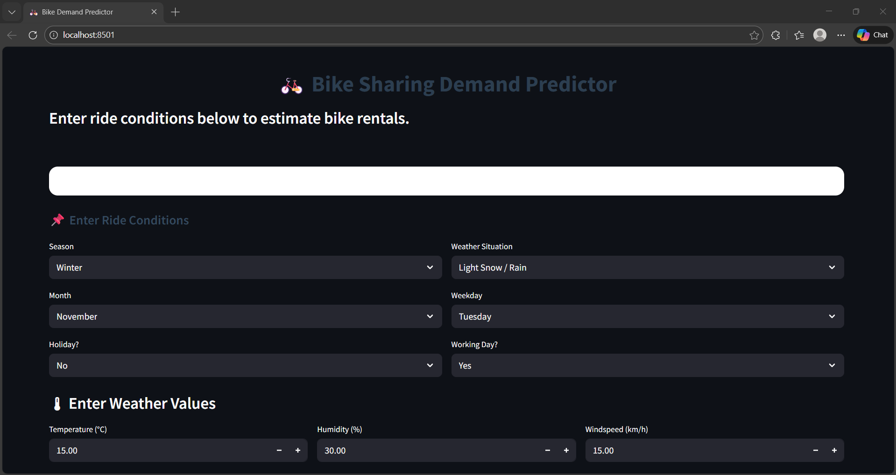
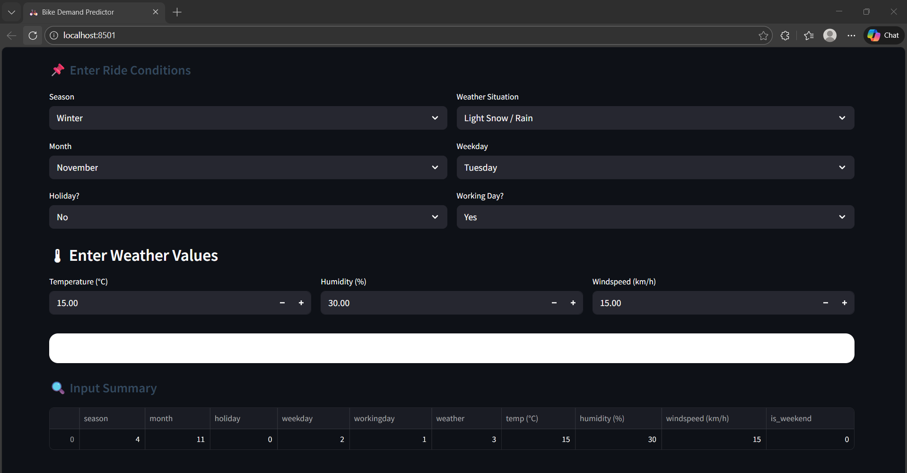
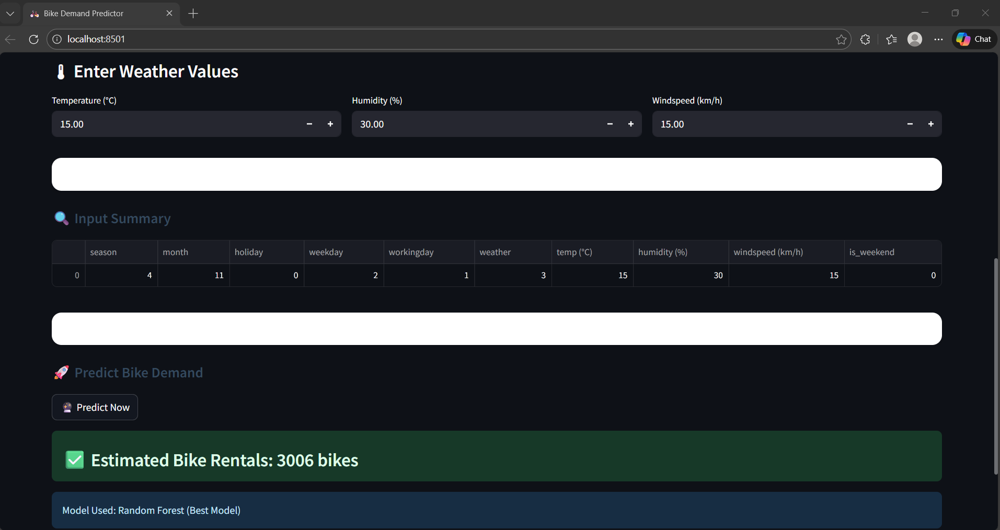

# 🚲 RideWise – Predicting Bike-Sharing Demand  

### Weather-Aware & Urban Event–Driven Demand Forecasting using Machine Learning & Streamlit

<p align="left">
  
  
  
  
  
</p>

---

## 📌 Overview

**RideWise** is an end-to-end **machine learning–based bike-sharing demand prediction system**.  
It forecasts the **number of bike rentals** using historical bike usage data, weather conditions, and calendar-based urban indicators.

The project helps:
- Urban planners  
- Bike-sharing operators  
- City transportation authorities  

to make **data-driven decisions** for fleet management and infrastructure planning.

---

## 🎯 Project Statement

The goal of this project is to build machine learning regression models to predict city bike-sharing demand.

The primary objectives are to forecast daily or hourly rental counts for a city’s bike-sharing system based on:
- Historical bike usage data  
- Weather information  
- City activity and calendar features  

---

## 🧠 Use Cases

### 1️⃣ Predicting Bike-Sharing Demand

**Description:**  
Predict the number of bike rentals for a given day or hour using weather conditions and temporal features.

**Applications:**
- Fleet rebalancing  
- Station stocking  
- Surge planning during events  
- Weather-aware operations  

---

### 2️⃣ Assessing Impact of Features

**Description:**  
Analyze how different factors affect demand:
- Temperature  
- Humidity  
- Windspeed  
- Holidays  
- Weekdays vs weekends  

**Applications:**
- Ridership optimization  
- Infrastructure planning  
- Policy decision support  

---

## 📊 Dataset Description

The dataset consists of historical bike-sharing records with the following attributes:

### Temporal Features
- Year  
- Month  
- Weekday  
- Working Day  
- Holiday  
- Weekend Indicator  

### Weather Features
- Temperature  
- Humidity  
- Windspeed  
- Weather Situation  

### Target Variable
- Bike Rental Count  

---

## ⚙️ Data Preprocessing & Feature Engineering

- Handling missing values  
- Encoding categorical features  
- Feature scaling using **StandardScaler**  
- Creation of derived features (`is_weekend`)  
- Dataset normalization  

---

## 🤖 Machine Learning Models

The following regression models were implemented and evaluated:

- Linear Regression  
- Ridge Regression  
- Lasso Regression  
- Decision Tree Regressor  
- **Random Forest Regressor (Best Model)**  

---

## 📈 Model Evaluation Metrics

Models were evaluated using:
- Mean Absolute Error (MAE)  
- Root Mean Squared Error (RMSE)  
- R² Score  

Evaluation plots and metric comparisons are stored in the outputs folder.

---

## 🧠 System Architecture

```mermaid
flowchart TD
    U[User] --> UI[Streamlit Web Application]

    UI --> |User Inputs| FE[Feature Engineering]
    FE --> SC[Data Scaling (StandardScaler)]

    SC --> MODEL[Trained ML Model\n(Random Forest Regressor)]
    MODEL --> |Predicted Bike Demand| UI

    DATA[Historical Bike-Sharing Dataset] --> PREP[Data Preprocessing]
    PREP --> TRAIN[Model Training & Evaluation]
    TRAIN --> MODEL
```

---

## 🎨 Streamlit Web Application

The project includes a **Streamlit-based interactive web app** that allows users to:
- Enter weather and calendar conditions  
- View input summaries  
- Instantly predict bike-sharing demand  

The app loads pre-trained models saved as `.pkl` files.

---

## 📸 Application Screenshots

| Home Page | Input Features | Prediction Output |
|---------|----------------|------------------|
|  |  |  |

> 📌 Create a folder named `screenshots/` in the repo and add the images with the above names.

---

## 📦 Installation & Setup

### 1️⃣ Clone the Repository
```bash
git clone https://github.com/preethrene/RideWise-Predicting-Bike-sharing-Demand.git
cd RideWise-Predicting-Bike-sharing-Demand
```

### 2️⃣ Install Dependencies
```bash
pip install -r requirements.txt
```

### 3️⃣ Run the Application
```bash
streamlit run bike_demand_app.py
```

---

## 📁 Project Structure

```
RideWise-Predicting-Bike-sharing-Demand/
│── bike_demand_app.py
│── requirements.txt
│── README.md
│
│── notebooks/
│   ├── Data_Preprocessing.ipynb
│   ├── LinearRegression_Model.ipynb
│   ├── Types_of_Regression.ipynb
│   ├── Actual_vs_Predicted_Bike_sharing.ipynb
│
│── models/
│   ├── linear_regression_model.pkl
│   ├── ridge_regression_model.pkl
│   ├── lasso_regression_model.pkl
│   ├── decision_tree_regression_model.pkl
│   ├── random_forest_regression_model.pkl
│   ├── scaler.pkl
│
│── data/
│   ├── preprocessed_data.xlsx
│
│── outputs/
│   ├── mae_comparison.png
│   ├── rmse_comparison.png
│   ├── r_squared_comparison.png
│   ├── actual_vs_predicted_scatter.png
│
│── reports/
│   ├── Preetham_Report.docx
│   ├── BIKE_SHARING_DEMAND_PREDICTION.pptx
```

---

## 🔮 Future Enhancements

- ⏱ Hour-level real-time prediction  
- 🌍 Live weather API integration  
- 🗺 Station-level forecasting  
- 📊 Dashboard analytics  
- 🤖 LSTM-based time series modeling  

---

## 🧪 Learning Outcomes

- Hands-on experience with regression models  
- Real-world feature engineering  
- Model evaluation and selection  
- End-to-end ML deployment  
- Streamlit UI development  

---

## 📝 License

This project is licensed under the **MIT License**.

```
MIT License

Copyright (c) 2026 Preetham N

Permission is hereby granted, free of charge, to any person obtaining a copy
of this software and associated documentation files (the "Software"), to deal
in the Software without restriction...
```

---

## ⭐ Acknowledgements

- Open-source ML community  
- Streamlit documentation  
- Scikit-learn contributors  

---

## ⭐ Support

If you found this project helpful:

- ⭐ Star the repository  
- 🍴 Fork and build on it  
- 📢 Share with others  

**Happy Learning & Building 🚀**
